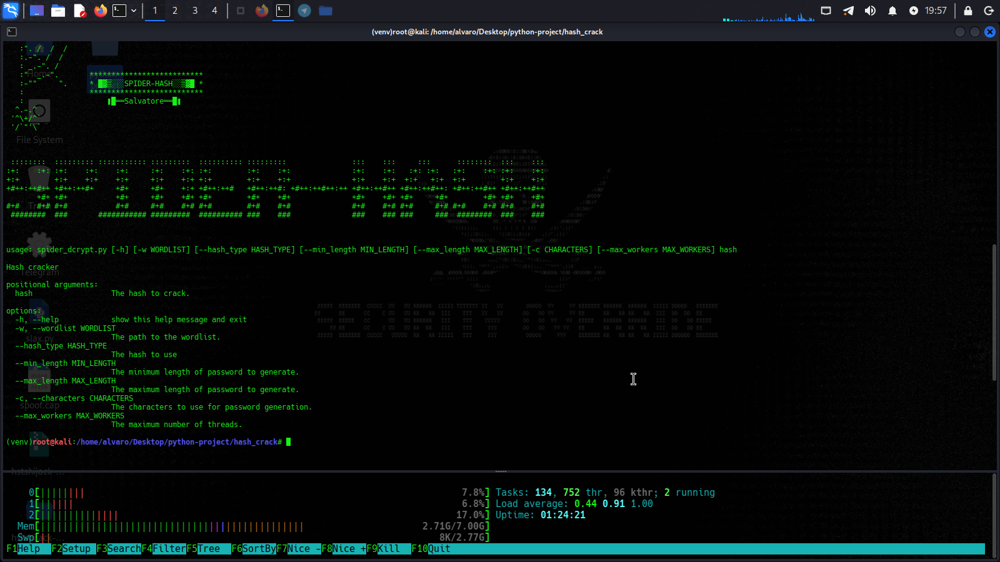

### SPIDER-HASH

[]()
[]()

This program will decrypt hash [sha,sha224,sha256,sha512,md5...etc]

### NOTICE

~~I'm no longer maintaining this project salvatore .~~

### install requirements

```
pip install tqdm

```
```
pip install hashlib

```
### Support                                                  

It motivates me to keep updating this program.

subscribe my channel

```                                                                 
https://youtu.be/Nx0FqqmzZLI

```                                                                       
  
# Linux & MacOS

* ```git clone https://github.com/blackmask00/spider-hash.git```
* ```cd spider-hash.```
* ```python spider_dcrypt.py```


This script is a hashlib application that performs a Mass Attack hash o>
The tool is intended to automate brutforce hash profiles by sending HTT>

### whatch video 

## Social media

```
https://youtube.com/@cyber-security_morocco_00

```

```
https://instagram.com/6ec_0

```
